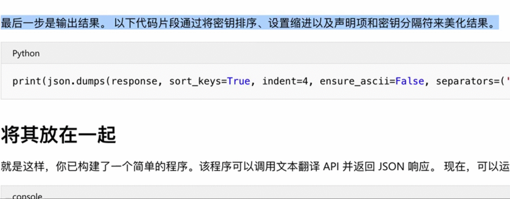
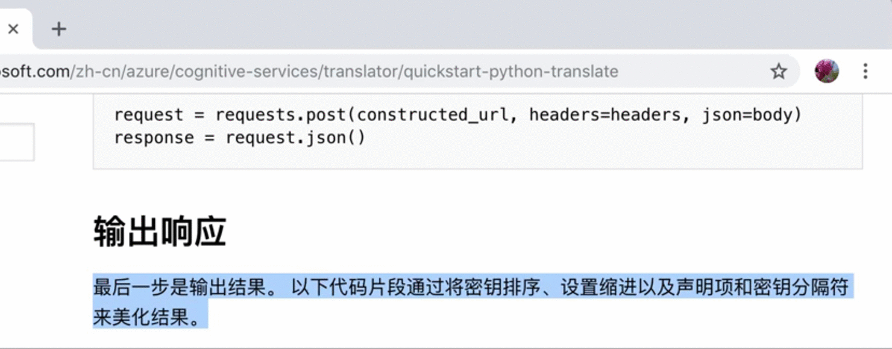
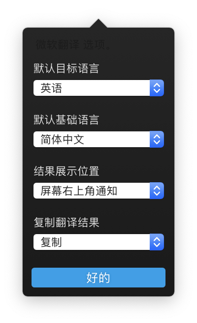

# PopClip的微软翻译插件

# 效果预览

居中弹窗提供复制选项

右上通知不提供复制选项

- 基于微软翻译API，支持大部分语言翻译为中文/英文
- 使用cocoDialog弹窗输出
- 可以支持所有微软翻译支持的语言互译，但是我懒，没添加，只添加了中英文
- 欢迎大家优化和添加新功能
- [PopClip 开发文档](https://github.com/pilotmoon/PopClip-Extensions)
- 里面的key是某位大佬提供，也没有加密，所有希望各位珍惜，有条件的自己申请一个替换掉
- 还是因为懒，README就这么多